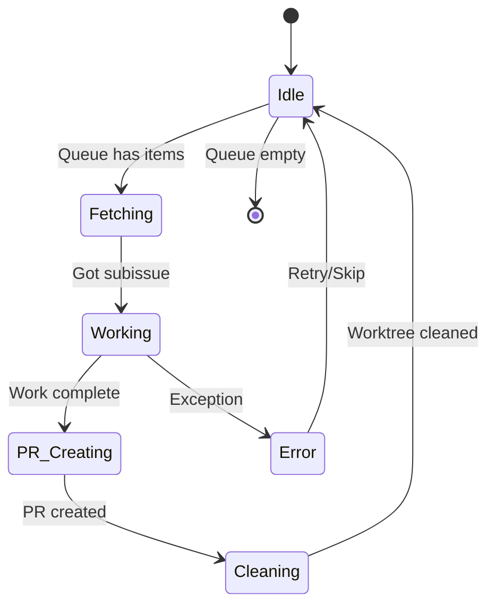

# Architecture Decision Record: Subissue-Based Worker Pool System

**ADR-001** | **Status**: Proposed | **Date**: 2024-12-05

## Context and Problem Statement

The current task-based system using GitHub issue checklists has become complex:
- Checklist management is cumbersome
- Task ID formats (#1-5) are confusing  
- Checkbox updating via GitHub Actions is fragile
- Manual task creation within issues is tedious

We need a simpler, more robust system for parallel development.

## Decision

Adopt a **subissue-based worker pool architecture** where:
1. Users prepare GitHub issues manually
2. System analyzes issues and creates subissues automatically
3. Worker pool (tmux sessions) processes subissues from a queue
4. Each worker handles complete subissue lifecycle (worktree → develop → PR → cleanup)
5. Parent issues close automatically when all subissues complete

## Detailed Design

### Core Components

```
┌─────────────┐     ┌──────────────┐     ┌─────────────┐
│   User      │────▶│  Analyzer    │────▶│   Queue     │
│  Issues     │     │   (Claude)   │     │ (Subissues) │
└─────────────┘     └──────────────┘     └─────────────┘
                                                │
                    ┌───────────────────────────┴─────────┐
                    ▼                ▼                    ▼
            ┌─────────────┐  ┌─────────────┐     ┌─────────────┐
            │  Worker 1   │  │  Worker 2   │ ... │  Worker N   │
            │   (tmux)    │  │   (tmux)    │     │   (tmux)    │
            └─────────────┘  └─────────────┘     └─────────────┘
                    │                │                    │
                    ▼                ▼                    ▼
            ┌─────────────┐  ┌─────────────┐     ┌─────────────┐
            │     PR      │  │     PR      │     │     PR      │
            └─────────────┘  └─────────────┘     └─────────────┘
```

### Command Interface

```bash
# Start work on single issue with 4 workers
/project:work 123 4

# Work on multiple issues with 10 workers  
/project:work 45,67,89 10

# Add more issues to running queue
/project:add 101,102

# Monitor progress
/project:status

# Stop gracefully
/project:stop
```

### Queue Management

```
Queue Structure:
PRIORITY|PARENT_ISSUE|SUBISSUE_ID|STATUS|ASSIGNED_TO|CREATED_AT

Example:
1|123|456|pending||2024-12-05T10:00:00
2|123|457|working|worker-1|2024-12-05T10:00:00
1|123|458|completed|worker-2|2024-12-05T10:00:00
```

### Worker Lifecycle



### Subissue Generation Strategy

1. **Analysis Phase** (Claude intelligence)
   - Read parent issue description
   - Identify logical work units
   - Estimate complexity and dependencies
   - Generate 2-5 subissues per parent

2. **Subissue Format**
   ```markdown
   Title: [Parent #123] Implement user authentication
   
   Parent Issue: #123
   Estimated Hours: 2-4
   
   ## Objective
   [Clear goal from parent issue]
   
   ## Acceptance Criteria
   - [ ] Unit tests pass
   - [ ] Integration works
   - [ ] Documentation updated
   
   ## Technical Notes
   [Any relevant context]
   ```

3. **Priority Assignment**
   - Bug fixes: Priority 1
   - Features: Priority 2  
   - Documentation: Priority 3
   - Refactoring: Priority 4

### State Persistence

```
.claude/workers/
├── queue.txt           # Active queue
├── completed.txt       # Completed subissues
├── state.json          # System state
├── worker-1.log        # Worker logs
├── worker-2.log
└── ...
```

### Error Handling

1. **Worker Crashes**: Automatic restart with backoff
2. **Failed Subissues**: Move to retry queue
3. **Stuck Workers**: Health check timeout (30 min)
4. **Queue Corruption**: Backup and rebuild from GitHub

## Consequences

### Positive
- ✅ Simple mental model (issues → subissues → PRs)
- ✅ No checklist management complexity
- ✅ Clear worker pool pattern
- ✅ Easy to monitor and debug
- ✅ Graceful scaling (add/remove workers)
- ✅ Resume capability after interruption
- ✅ Clean GitHub integration

### Negative  
- ❌ More GitHub API calls (creating subissues)
- ❌ Potential subissue explosion
- ❌ Requires upfront issue preparation
- ❌ Less granular than task-level

### Neutral
- 🔄 Different workflow from task-based
- 🔄 Requires Claude for intelligent analysis
- 🔄 Tmux dependency remains

## Implementation Plan

### Phase 1: Core System (Week 1)
1. Queue manager (`/tools/queue`)
2. Worker manager (`/tools/worker`)  
3. Issue analyzer (`/tools/analyze`)
4. Basic `/project:work` command

### Phase 2: Intelligence (Week 2)
1. Smart subissue generation
2. Dependency detection
3. Priority assignment
4. Work estimation

### Phase 3: Monitoring (Week 3)
1. Progress dashboard
2. Worker health checks
3. Performance metrics
4. Error reporting

### Phase 4: Polish (Week 4)
1. Resume capability
2. Graceful shutdown
3. Configuration options
4. Documentation

## Alternatives Considered

1. **Keep task-based system**: Too complex for users
2. **Direct issue assignment**: No parallelism within issues
3. **External queue (Redis/RabbitMQ)**: Over-engineering
4. **Process-based workers**: Less debuggable than tmux

## Review and Sign-off

- **Proposed by**: Claude + User collaboration
- **Date**: 2024-12-05
- **Status**: Awaiting implementation

## Updates

- 2024-12-05: Initial design proposed