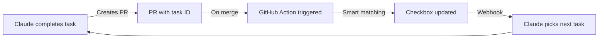

# 🤖 Automated Issue Checklist Update Strategies

## 🎯 **Goal: Zero-Touch Checklist Management**

When a PR for a task is merged, the corresponding checkbox in the parent issue should automatically be checked.

---

## 📊 **Strategy Comparison**

### **1. Position-Based Matching** (Current Implementation)
```javascript
// Task #1-5 = 5th checkbox in issue #1
const checkboxCount = 0;
for (line of lines) {
  if (line.match(/^\s*-\s*\[\s*\]/)) {
    checkboxCount++;
    if (checkboxCount === taskNum) {
      // Update this checkbox
    }
  }
}
```

**Pros:**
- Simple and fast
- Works if checklist order is stable
- No complex parsing needed

**Cons:**
- Breaks if checkboxes are reordered
- Fails if checkboxes are added/removed
- Manual tasks can throw off counting

---

### **2. Content-Based Matching**
```javascript
// Match by task description
const taskDesc = "Create database schema";
for (line of lines) {
  if (line.includes(taskDesc)) {
    line.replace(/\[\s*\]/, '[x]');
  }
}
```

**Pros:**
- Order-independent
- Survives checkbox reorganization
- More intuitive

**Cons:**
- Requires exact text match
- Descriptions might change
- Partial matches could be wrong

---

### **3. Task ID Embedding**
```markdown
## Tasks
- [ ] Create database schema <!-- task:1-1 -->
- [ ] Add API endpoints <!-- task:1-2 -->
- [ ] Write tests <!-- task:1-3 -->
```

**Pros:**
- Unambiguous matching
- Survives any reordering
- Hidden from normal view

**Cons:**
- Requires initial setup
- Comments might be stripped
- Not GitHub native

---

### **4. Fuzzy Matching**
```javascript
// Use similarity scoring
const similarity = stringSimilarity(checkboxText, prDescription);
if (similarity > 0.8) {
  // Match found
}
```

**Pros:**
- Handles minor text changes
- More flexible
- Better user experience

**Cons:**
- Can have false positives
- Computationally heavier
- Needs threshold tuning

---

### **5. PR Metadata Approach**
```yaml
# In PR body
---
task_id: 1-5
checkbox_text: "Create database schema"
---
```

**Pros:**
- Explicit mapping
- Very reliable
- Easy to debug

**Cons:**
- Requires PR template
- Manual input needed
- Can be forgotten

---

## 🚀 **Recommended Hybrid Approach**

```javascript
async function updateChecklist(pr, issue) {
  // Step 1: Extract task ID from multiple sources
  const taskId = extractTaskId(pr.title, pr.branch, pr.body);
  
  // Step 2: Try multiple matching strategies
  let matched = false;
  
  // Strategy A: Position-based (if tasks not reordered)
  if (!matched) {
    matched = tryPositionMatch(issue.body, taskId.taskNum);
  }
  
  // Strategy B: Smart content match
  if (!matched) {
    const keywords = extractKeywords(pr.title);
    matched = tryContentMatch(issue.body, keywords);
  }
  
  // Strategy C: Fuzzy match as fallback
  if (!matched) {
    matched = tryFuzzyMatch(issue.body, pr.title);
  }
  
  // Step 3: Update with confidence score
  if (matched.confidence > 0.8) {
    updateIssue(matched.line);
  } else {
    // Flag for manual review
    addCommentForReview(issue, pr, matched);
  }
}
```

---

## 🛡️ **Edge Cases & Solutions**

### **1. Multiple Checkboxes Updated**
**Problem**: PR completes multiple tasks
**Solution**: Allow comma-separated task IDs: `#1-5,#1-6`

### **2. Nested Checkboxes**
```markdown
- [ ] Main task
  - [ ] Subtask 1
  - [ ] Subtask 2
```
**Solution**: Flatten or use hierarchical task IDs: `#1-5-1`

### **3. Manual Tasks**
```markdown
- [ ] 👤 Get approval (manual)
```
**Solution**: Skip lines with manual indicators

### **4. Already Checked Boxes**
**Problem**: Task already marked complete
**Solution**: Log but don't error, add reconciliation comment

### **5. Checkbox in Code Blocks**
````markdown
```
- [ ] This shouldn't be updated
```
````
**Solution**: Parse only outside code blocks

---

## 🔧 **Enhanced Implementation**

```yaml
name: Smart Checklist Updater
on:
  pull_request:
    types: [closed]

jobs:
  update-checklist:
    if: github.event.pull_request.merged == true
    runs-on: ubuntu-latest
    steps:
      - uses: actions/github-script@v7
        with:
          script: |
            // Multi-strategy matching system
            const matcher = new ChecklistMatcher({
              strategies: ['position', 'content', 'fuzzy'],
              confidence_threshold: 0.8,
              manual_indicators: ['👤', 'manual', 'MANUAL'],
              debug: true
            });
            
            // Extract task info from PR
            const taskInfo = matcher.extractTaskInfo({
              title: context.payload.pull_request.title,
              body: context.payload.pull_request.body,
              branch: context.payload.pull_request.head.ref
            });
            
            // Update all related issues
            for (const task of taskInfo.tasks) {
              const result = await matcher.updateIssue(task);
              
              // Add status comment
              await github.rest.issues.createComment({
                owner: context.repo.owner,
                repo: context.repo.repo,
                issue_number: task.issueNum,
                body: result.success 
                  ? `✅ Task #${task.id} automatically marked complete (confidence: ${result.confidence})`
                  : `⚠️ Task #${task.id} may need manual update (confidence: ${result.confidence})`
              });
            }
```

---

## 📈 **Metrics & Monitoring**

Track automation success:
```javascript
// Log to GitHub Action summary
await core.summary
  .addHeading('Checklist Update Results')
  .addTable([
    [{data: 'Task', header: true}, {data: 'Status', header: true}, {data: 'Confidence', header: true}],
    ['#1-5', '✅ Updated', '95%'],
    ['#1-6', '⚠️ Manual Review', '65%']
  ])
  .write();
```

---

## 🎯 **Best Practices**

1. **Consistent Task Naming**
   - Always use format: `Complete task #X-Y: Description`
   - Branch name: `task/X-Y-description`

2. **PR Body Template**
   ```markdown
   Updates #X by completing:
   - [x] Exact checkbox text from issue
   ```

3. **Fallback Mechanisms**
   - Add comment if update fails
   - Link to manual update instructions
   - Tag maintainer for review

4. **Testing**
   - Dry run mode for testing
   - Preview changes before applying
   - Rollback capability

---

## 🚀 **Future Enhancements**

1. **Two-Way Sync**
   - Update PR status from issue checkbox
   - Sync checkbox state across related issues

2. **Smart Dependencies**
   - Auto-check dependent tasks
   - Block unchecking if dependencies exist

3. **Progress Tracking**
   - Update issue labels (25%, 50%, 75%, 100%)
   - Generate progress reports

4. **Integration with Claude Sessions**
   - Session marks task complete → triggers PR
   - PR merged → checkbox updated → session picks next task

---

## 💡 **Ultimate Vision**



**Result**: Fully autonomous development cycle with zero manual checkbox management! 🎉