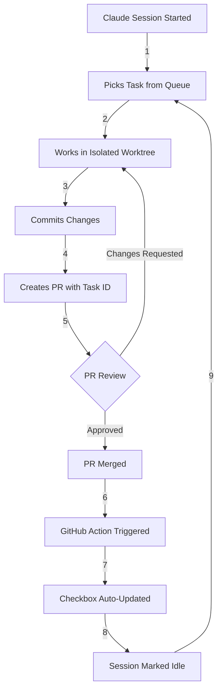

# 🚀 Complete Task Automation Workflow

## 🎯 **Vision: Fully Automated Development Loop**



---

## 📋 **Components Overview**

### **1. Session Management** ✅
- Auto-approval daemon for 99% autonomy
- Task-specific worktrees
- Automatic PR creation instructions

### **2. PR Standards** ✅
- Title: `Complete task #X-Y: Description`
- Body: Contains `Updates #X`
- Branch: `task/X-Y-description`

### **3. GitHub Actions** ✅
- Triggers on PR merge
- Extracts task ID from PR
- Updates specific checkbox
- Adds confirmation comment

### **4. Checklist Sync Tool** ✅
- Manual sync capability
- Preview mode
- Issue status checking

---

## 🔧 **Setup Instructions**

### **Step 1: Install GitHub Actions**
```bash
# Copy the workflows to your repo
mkdir -p .github/workflows
cp .claude/templates/update-issue-checklist.yml .github/workflows/
cp .claude/templates/smart-checklist-updater.yml .github/workflows/
```

### **Step 2: Configure PR Template**
```bash
# Create PR template
mkdir -p .github
cat > .github/pull_request_template.md << 'EOF'
## Summary
[Describe changes]

## Task Completion
Updates #ISSUE by completing:
- [x] [Copy exact checkbox text from issue]

## Testing
- [ ] Tests pass
- [ ] Code reviewed
- [ ] Documentation updated

---
🤖 Generated with [Claude Code](https://claude.ai/code)
Co-Authored-By: Claude <noreply@anthropic.com>
EOF
```

### **Step 3: Start Automated Sessions**
```bash
# Start parallel sessions with auto-approval
./tools/session start 4
./tools/auto-approve start 4 &

# Monitor progress
watch -n 5 './tools/session list'
```

---

## 📊 **Monitoring & Management**

### **Real-time Dashboard**
```bash
# Create monitoring script
cat > monitor-tasks.sh << 'EOF'
#!/bin/bash
clear
echo "🤖 TASK AUTOMATION DASHBOARD"
echo "============================"
echo ""
echo "📋 Active Sessions:"
./tools/session list | grep working
echo ""
echo "🔄 Recent PRs:"
gh pr list --limit 5
echo ""
echo "✅ Completed Today:"
gh pr list --state merged --search "created:>$(date -u -d '1 day ago' '+%Y-%m-%d')"
echo ""
echo "📊 Issue Progress:"
./tools/checklist-sync check 1
EOF

chmod +x monitor-tasks.sh
watch -n 10 ./monitor-tasks.sh
```

### **Manual Sync (If Needed)**
```bash
# Preview what would be updated
./tools/checklist-sync preview

# Force sync all PRs
./tools/checklist-sync sync

# Check specific issue
./tools/checklist-sync check 47
```

---

## 🎨 **Advanced Features**

### **1. Smart Task Assignment**
```bash
# Assign tasks based on complexity
assign_by_complexity() {
    local session_id=$1
    local complexity=$(./tools/task next --show-complexity)
    
    case $complexity in
        "high")
            # Assign to most experienced session
            ./tools/session assign $session_id "#$task_id" --extended-thinking
            ;;
        "low")
            # Quick task, no special flags
            ./tools/session assign $session_id "#$task_id"
            ;;
    esac
}
```

### **2. Progressive Automation**
```javascript
// In GitHub Action - learn from successful matches
const updateHistory = await getUpdateHistory();
const successRate = updateHistory.filter(u => u.success).length / updateHistory.length;

if (successRate > 0.95) {
    // High confidence - auto-merge small PRs
    await enableAutoMerge(pr);
}
```

### **3. Failure Recovery**
```yaml
# In workflow - handle update failures
- name: Fallback Update
  if: failure()
  run: |
    # Create manual update issue
    gh issue create \
      --title "Manual checklist update needed for PR #${{ github.event.pull_request.number }}" \
      --body "Automated update failed. Please manually check the box for task $TASK_ID in issue #$ISSUE_NUM" \
      --label "manual-update-needed"
```

---

## 📈 **Metrics & Reporting**

### **Weekly Automation Report**
```bash
# Generate automation metrics
cat > weekly-report.sh << 'EOF'
#!/bin/bash
echo "📊 WEEKLY AUTOMATION REPORT"
echo "=========================="
echo ""
echo "Tasks Completed: $(gh pr list --state merged --search "task/" --limit 100 | wc -l)"
echo "Success Rate: $(./tools/checklist-sync preview | grep "Would update" | wc -l)%"
echo "Avg Time/Task: $(calculate_avg_time)"
echo "Manual Interventions: $(gh issue list --label "manual-update-needed" | wc -l)"
EOF
```

---

## 🚨 **Troubleshooting**

### **Issue: Checkbox Not Updating**
1. Check PR title/branch format
2. Verify "Updates #X" in PR body
3. Run manual sync: `./tools/checklist-sync sync`
4. Check Action logs: `gh run list --workflow=smart-checklist-updater.yml`

### **Issue: Session Stuck**
1. Check auto-approve daemon: `ps aux | grep auto-approve`
2. Restart if needed: `pkill -f auto-approve && ./tools/auto-approve start 4 &`
3. Manual intervention: `tmux attach -t claude-1`

### **Issue: Wrong Checkbox Updated**
1. Check task numbering consistency
2. Use content-based matching in Action
3. Add task IDs as HTML comments

---

## 🎯 **Best Practices**

### **1. Consistent Naming**
```bash
# ✅ Good
Complete task #47-3: Add user authentication
task/47-3-add-user-authentication

# ❌ Bad
Fix auth issue
feature/authentication
```

### **2. Clear PR Bodies**
```markdown
## Summary
Implements JWT authentication for API endpoints

## Issue Update
Updates #47 by completing:
- [x] Add user authentication

## Testing
- Unit tests added
- Integration tests pass
- Manual testing completed
```

### **3. Task Granularity**
- Each task < 4 hours of work
- Clear acceptance criteria
- Minimal dependencies

---

## 🌟 **Result**

With this complete automation:
- **Claude sessions** work autonomously (99%)
- **PRs** are created with proper formatting
- **Checklists** update automatically on merge
- **Sessions** pick up next task immediately
- **Progress** is visible in real-time

**Human involvement**: Only PR reviews! 🎉

---

## 🔮 **Future Enhancements**

1. **AI-Powered PR Reviews**
   - Auto-approve small, safe changes
   - Flag risky modifications
   
2. **Predictive Task Assignment**
   - Learn session strengths
   - Optimize task distribution
   
3. **Cross-Repo Orchestration**
   - Manage tasks across multiple repos
   - Coordinate dependencies

4. **Natural Language Commands**
   ```
   "Claude, work on all authentication tasks"
   "Show me what's blocking the API feature"
   "Prioritize bug fixes today"
   ```

The future is fully automated, intelligent development! 🚀