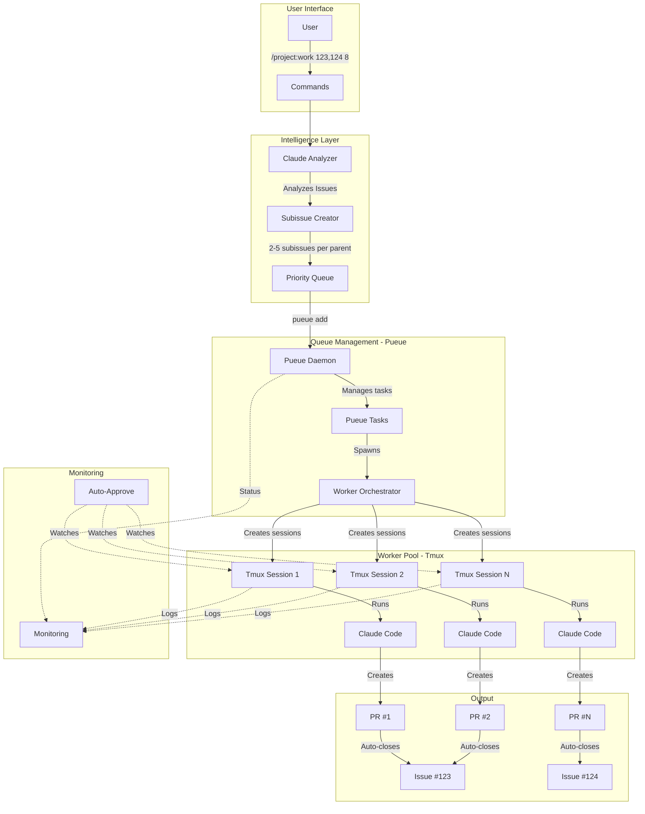
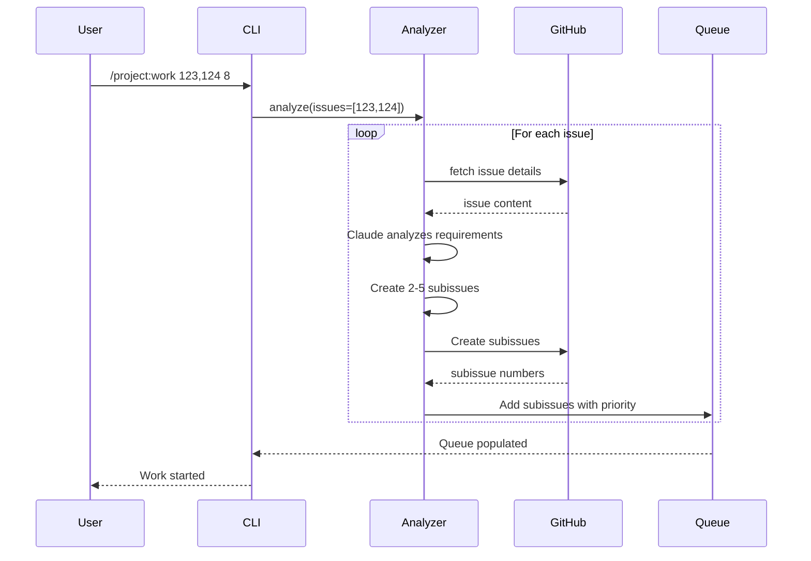
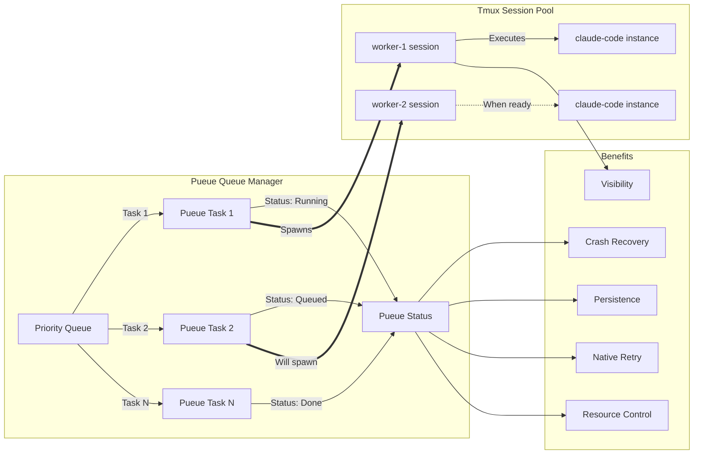
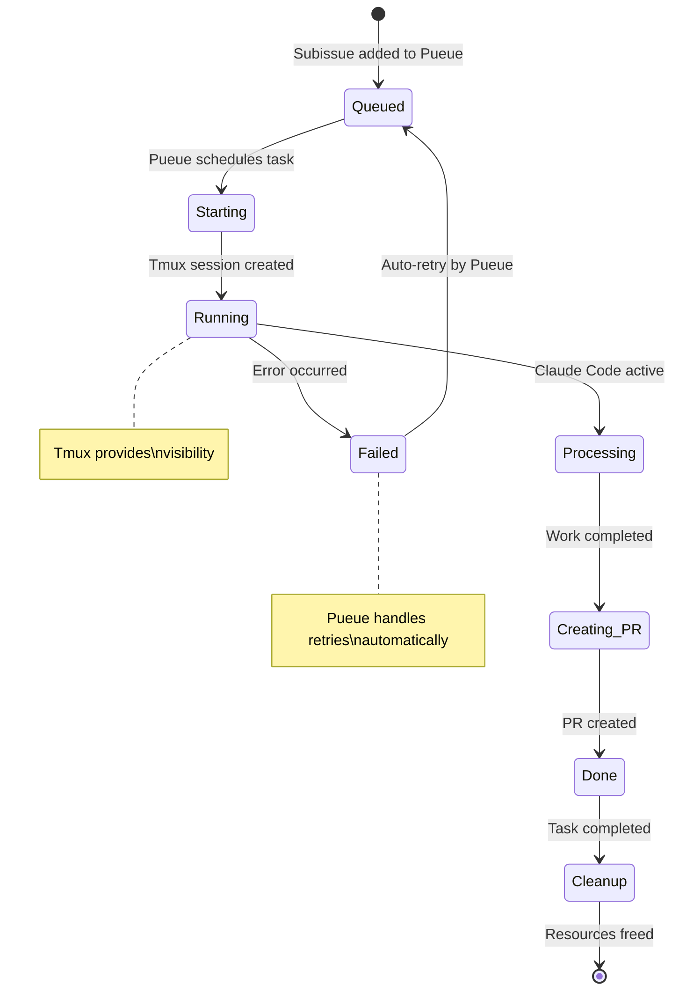
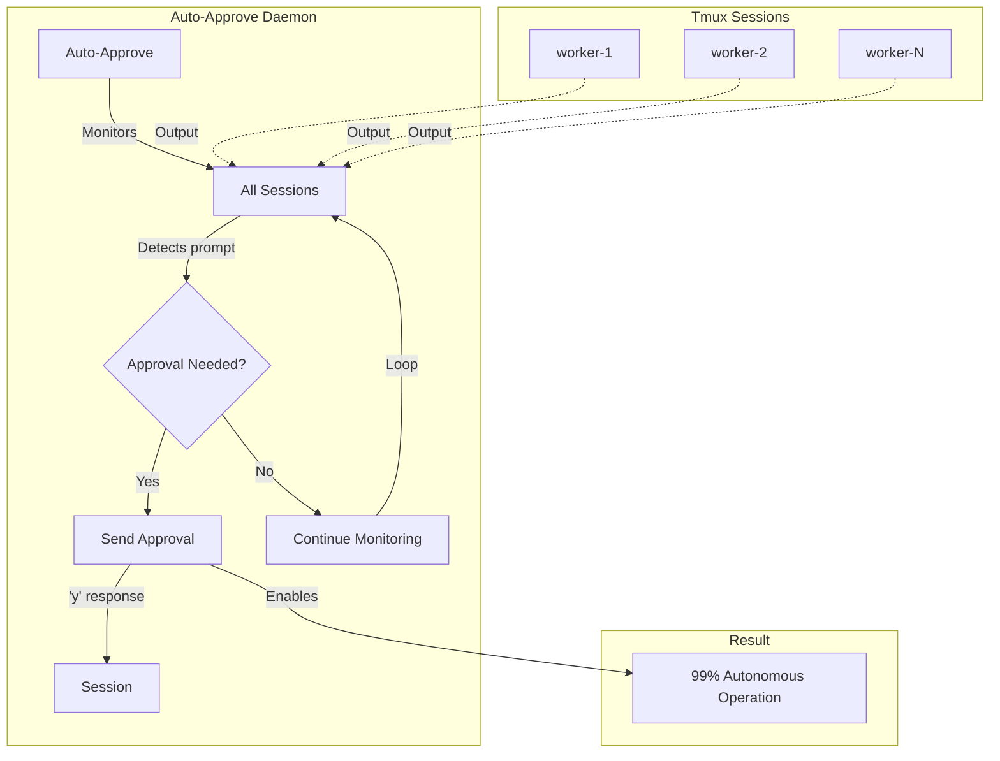
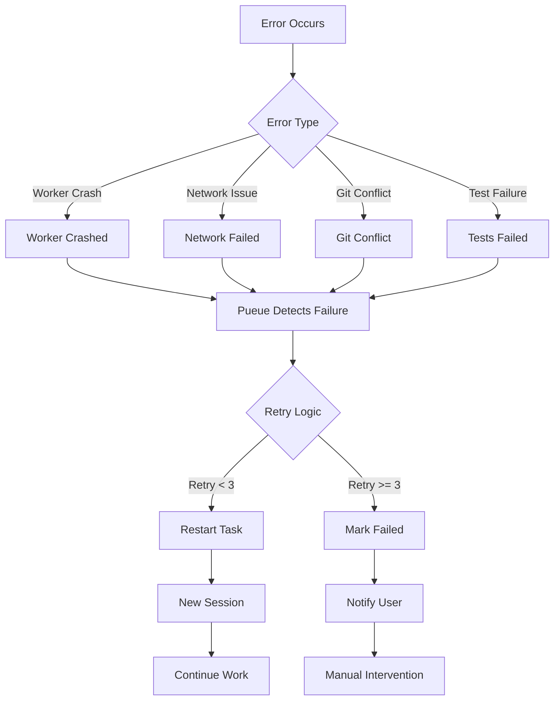
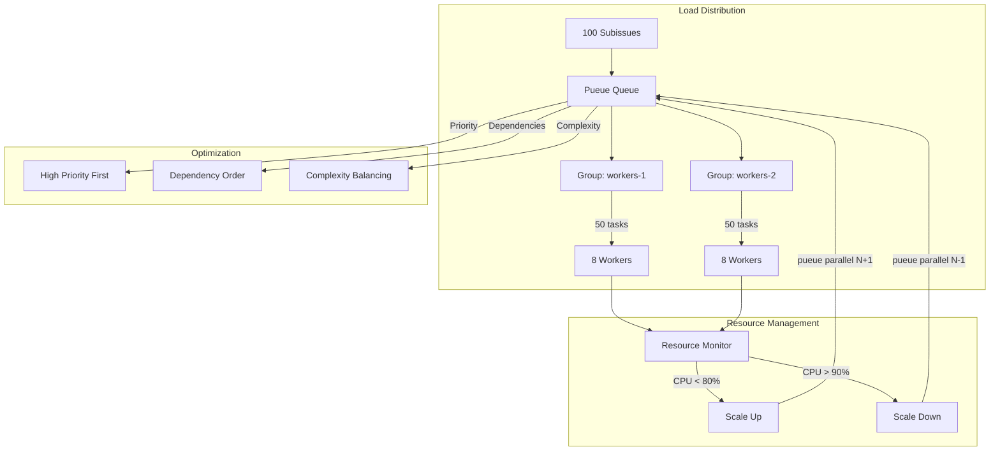
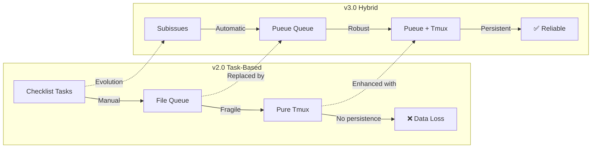
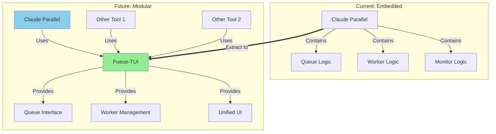

# Architecture Diagrams - Claude Code Parallel v0.3.0

## Overview: Hybrid Pueue+Tmux Architecture

## Detailed Component Flow

### 1. Issue Analysis and Decomposition

### 2. Hybrid Queue and Worker Management

### 3. Worker Lifecycle

### 4. Auto-Approval Integration

### 5. Error Recovery Flow

### 6. Performance Architecture

## Architecture Evolution

### From v2.0 to v3.0 Hybrid

## Future Architecture: Pueue-TUI

## Key Architecture Benefits

1. **Reliability**: Pueue provides industrial-grade queue management
2. **Visibility**: Tmux sessions allow Claude Code to function normally
3. **Persistence**: Queue state survives crashes and reboots
4. **Scalability**: Easy to scale workers up/down with Pueue groups
5. **Simplicity**: Clean separation of concerns between queue and execution
6. **Compatibility**: Works seamlessly with existing Claude Code workflows

## Architecture Decision Records

- [ADR-001](../../archive/proposals/ADR-001-SUBISSUE-WORKER-ARCHITECTURE.md): Subissue-Based Worker Pool
- [ADR-002](../adr/ADR-002-SINGLE-TMUX-VS-PUEUE.md): Analysis of Single Tmux vs Pueue
- [ADR-003](../adr/ADR-003-HYBRID-PUEUE-TMUX.md): Hybrid Pueue+Tmux Architecture
- [ADR-004](../adr/ADR-004-PUEUE-NATIVE-AND-PUEUE-TUI.md): Future Pueue-TUI Extraction